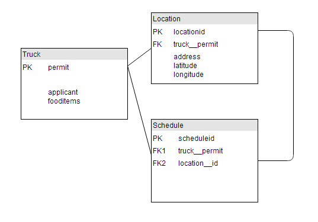
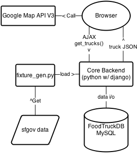

Food Truck San Francisco
========================

----------

##Introduction##
This is a web application that shows the user food truck locations near a certain address and information for the trucks. It also allows the user to filter the results according to what they want to eat, distance, whether it's currently open etc.. 

It includes both backend and frontend implementations. It's written with python + django framework, along with html, css and javascript(jQuery) for the frontend.

### Usage ###
Allow the browser to use your current location so that the app can center the map to your location. If not allowed or not supported, it will use a location near center San Francisco to start with. 

Enter a valid address, well-known location name, or a zip code, it will geocode the input and center the map there.

Click the truck icons on the map will give you the food truck information on the bottom left area.

Filter the results with whether it's open now, food you want to eat (e.g. Chinese, Indian, Burger, pizza, fruit, etc. separate by commas space semi-colons) and the distance in miles to the current location by clicking the Filter Result button.

##Design and Decisions##
Generally, as mentioned in the introduction, it's written in python with django framework. Particularly for this application I would think it could be much easier to implement and host in PHP, since it's a Single Page Application. It doesn't really require any structure. But thinking about extendability, I still went with the current solution. And after playing with it I think I might migrate my personal site in python w/ django in the future. Show some LOVE to python!

 
###Backend###
The data is from the public website [data.sfgov.org](https://data.sfgov.org/Permitting/Mobile-Food-Facility-Permit/rqzj-sfat). It provides an API for querying JSON data back for specific needs. But it will be too slow to go over the wire every time you want something. 
So I wrote a python script `fixture_gen.py` to pull the data I want and format it to a "fixture" which is a JSON file that django can read and load into db. 

With the fixture generator we can write a cron job to pull data from the site every month or even longer (since I think food truck schedules don't change very often, as permits are renewed annually). And we don't need connections to the site anymore.

For DB choice I'm using `MySQL` for it is highly relational data as per my table design. And MySQL is well supported and easy to use.

With the data in-place, we are ready to serve the food truck information to front end with a simple RESTful GET call.

###Frontend###
All location/geographic and map related stuffs are all done by integrating google map API V3. Simple and efficient UX is implemented with CSS and Javascript(jQuery). After opening the index page all other interactions with server are done with `AJAX` calls. 

No heavy javascript library is in use since jQuery is enough for the need. 

##Code Structure and System Workflow###
Enough words already. Using some diagrams to show the structure and workflows.

###Directory Structure###
It's a simple django project with only one app.  
Marked **BOLD** for the files that are written/generated by my code.

├── **data.json**  
├── **fixture_gen.py**  
├── manage.py  
├── foodtrucks  
│   ├── admin.py  
│   ├── \__init__.py  
│   ├── **models.py**  
│   ├── static  
│   │   └── foodtrucks  
│   │       ├──- images  
│   │       │   ├──- background.jpg  
│   │       │   └──- foodtruckicon.png  
│   │       ├──- jquery-1.11.0.min.js  
│   │       ├──- **style.css**  
│   │       └──- **index.js**  
│   ├── templates  
│   │   └── foodtrucks  
│   │       ├─── **index.html**  
│   │       └─── **layout.html**  
│   ├── tests.py  
│   ├── urls.py  
│   └── **views.py**  
 
data.json is the sample fixture generated by fixture_gen.py

other bolded files should be self-explanatory

###Model Structure###

According to the data provided by sfgov, each location can only hold one truck owner, which means even if same address may have different applicants, they will have different location ids. So it makes sense to me to build such a relation that "one-truck-to-many-locations" "one-location-to-many-schedules" "one-truck-to-many-schedules"
structure.
###System Flow###

##Claims and Improvements##
I don't have any python in-production experience so this is my very first python project. I put some time in learning django framework as well. As I said in introduction, it can be much easier if written in PHP. But I do like the decision I made. 

Once started it's really hard to stop, lots of things can still be added. Given that this is just a prototype for interview purpose, and I don't have any more time on it since I have to use my free evenings to implement this, I will just stop here. Just to throw some ideas as notes if this project will be continued by myself or even someone else

- Add testcases for backend calls.  
Test is a really important process, but given there's very few backend functions implemented, and they work fine for their purposes, I didn't implement testcases. 

- Add user managements so that we can store user preferences, user address, user reviews etc.  

- Add detail pages for the foodtrucks 

All code is written or generated by Yu Chen(Hylas)  
Images and icons are found from internet. 
